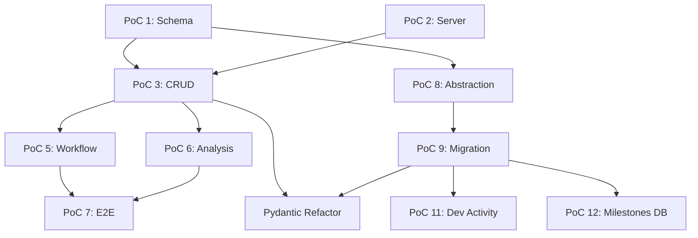
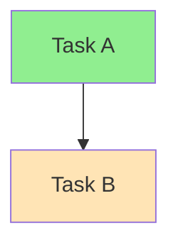
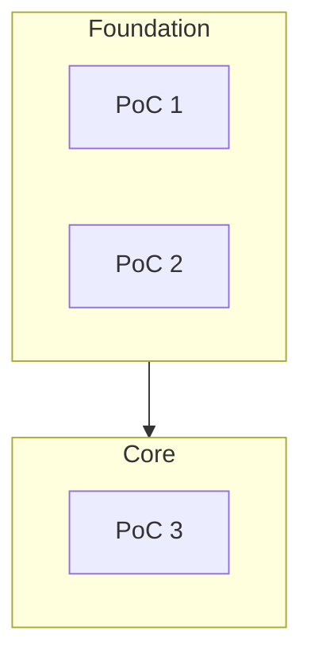
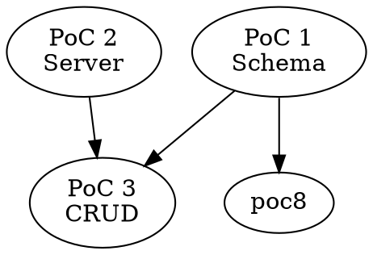

# Research: Dependency Diagram Generation Tools

**Date:** 2025-01-15
**Purpose:** Find a reliable tool for generating task dependency diagrams from Mission Control data

---

## Problem Statement

Manual ASCII diagram generation by Claude is error-prone:
- Horizontal vs vertical orientation confusion
- Spacing and layout issues
- Missing dependencies
- Floating disconnected boxes
- Inconsistent results across sessions

**Need:** A tool that takes dependency data as input and generates correct diagrams automatically.

---

## Tools Researched

### 1. Mermaid.js (Recommended)

**What it is:** JavaScript-based diagramming tool using markdown-like text syntax.

**Key Benefits:**
- **Native GitHub/GitLab rendering** - Diagrams render automatically in markdown files
- **Simple text syntax** - Easy for Claude to generate
- **Direction control** - `TB` (top-bottom), `LR` (left-right), etc.
- **Handles DAGs** - Directed acyclic graphs with multiple parents
- **No external dependencies** - Just text in a code block

**Syntax Example:**


**Dual Dependencies:** Simply connect multiple parents to same child:
```
A --> C
B --> C
```
Mermaid automatically handles the merge visually.

**Styling:**


**Subgraphs for grouping:**


**Resources:**
- [Official Documentation](https://mermaid.js.org/)
- [Flowchart Syntax](https://mermaid.js.org/syntax/flowchart.html)
- [Live Editor](https://mermaid.live)
- [GitHub Blog - Using Mermaid](https://github.blog/developer-skills/github/include-diagrams-markdown-files-mermaid/)

---

### 2. Graphviz / DOT Language

**What it is:** Open-source graph visualization software with DOT language.

**Key Benefits:**
- **Powerful layout algorithms** - Handles complex graphs automatically
- **Programmatic generation** - DOT files are plain text, easy to generate
- **Multiple output formats** - SVG, PNG, PDF
- **Python library (pydot)** - Generate DOT from Python code

**Syntax Example:**


**Drawbacks:**
- Requires external rendering (not native in GitHub markdown)
- Need to install Graphviz or use online tool
- Output is image, not text

**Resources:**
- [Graphviz Official](https://graphviz.org/)
- [DOT Language Guide](https://graphviz.org/doc/info/lang.html)
- [pydot (Python)](https://github.com/pydot/pydot)
- [Online DOT Editor](https://www.devtoolsdaily.com/graphviz/)

---

### 3. ascii-dag (Rust)

**What it is:** Lightweight ASCII DAG renderer for terminal environments.

**Key Benefits:**
- Zero dependencies
- Fast Sugiyama-style layout algorithm
- Handles diamond dependencies and skip-level edges
- Pure ASCII output

**Drawbacks:**
- Requires Rust
- CLI tool, not markdown-native
- Limited styling options

**Resources:**
- [GitHub Repository](https://github.com/AshutoshMahala/ascii-dag)

---

### 4. D3-dag (JavaScript)

**What it is:** D3.js-based DAG layout library.

**Key Benefits:**
- Handles large DAGs (500+ nodes) faster than Graphviz
- Great animations and styling
- Web-based rendering

**Drawbacks:**
- Requires JavaScript environment
- Not markdown-native
- More complex setup

**Resources:**
- [GitHub Repository](https://github.com/erikbrinkman/d3-dag)

---

### 5. DAGitty

**What it is:** Browser-based DAG editor focused on causal diagrams.

**Key Benefits:**
- Interactive drawing
- Built-in analysis tools
- Free to use

**Drawbacks:**
- Manual drawing, not programmatic
- Focused on causal analysis, not software dependencies

**Resources:**
- [DAGitty Website](https://www.dagitty.net/)

---

## The Gap: No ASCII Layout Engine Exists

What we actually need is an **ASCII physics/layout engine**:

**Input:**
- Boxes of different sizes (our detailed task content)
- Dependency relationships between them

**Output:**
- Automatically positioned ASCII layout with proper connections

### Tool Comparison

| Tool | Layout Engine | Variable Box Sizes | ASCII Output | Programmable |
|------|---------------|-------------------|--------------|--------------|
| Graph-Easy | Grid/Manhattan | ❓ (unclear) | ✅ | ✅ Perl |
| Graphviz | dot/neato/elk | ✅ | ❌ images only | ✅ |
| Mermaid | dagre/elk | ❌ simple labels | ❌ renders SVG | ✅ |
| Monodraw | Custom | ✅ | ✅ | ❌ GUI only |
| ascii-dag | Sugiyama | ❌ fixed size | ✅ | ✅ Rust |
| ASCIIFlow | Manual | ✅ | ✅ | ❌ GUI only |

### The Core Problem

**No tool exists that takes variable-sized ASCII boxes + relationships and auto-layouts them.**

- Graphviz has great layout algorithms but outputs images
- ASCII tools have simple layouts but only handle fixed-size/single-line nodes
- GUI tools (Monodraw, ASCIIFlow) can do it manually but aren't programmable

---

## Solution: ASCII DAG Generator with Layout Engine

Use an existing layout engine for positioning, custom renderer for ASCII output.

### Implementation Options

#### Option A: MCP Tool + Claude Renders

```
┌─────────────────┐     ┌─────────────────┐     ┌─────────────────┐
│   MCP Tool      │     │    Claude       │     │    Output       │
│                 │     │                 │     │                 │
│ • Fetch tasks   │────►│ • Read JSON     │────►│ • Clean ASCII   │
│ • Graphviz      │     │ • Place boxes   │     │   diagram       │
│ • Return JSON   │     │ • Draw edges    │     │                 │
└─────────────────┘     └─────────────────┘     └─────────────────┘
```

**Pros:** Already have MCP infrastructure, clean separation (math vs art)
**Cons:** Claude rendering might vary session to session

#### Option B: Pure Python Tool (CLI)

```
┌─────────────────────────────────────────┐     ┌─────────────────┐
│           Python CLI Tool               │     │    Output       │
│                                         │     │                 │
│ • Fetch tasks                           │────►│ • ASCII file    │
│ • Graphviz layout                       │     │   or stdout     │
│ • Render ASCII (all in code)            │     │                 │
└─────────────────────────────────────────┘     └─────────────────┘
```

**Pros:** Deterministic output, standalone, testable
**Cons:** Edge routing in code is hard, no "judgment" for edge cases

#### Option C: Python Tool + Claude API Inside

```
┌─────────────────────────────────────────────────────────────────┐
│                    Python Tool                                  │
│  ┌─────────────┐     ┌─────────────┐     ┌─────────────┐       │
│  │ Layout      │────►│ Claude API  │────►│ Final       │       │
│  │ (Graphviz)  │     │ "Fix this"  │     │ Render      │       │
│  └─────────────┘     └─────────────┘     └─────────────┘       │
└─────────────────────────────────────────────────────────────────┘
```

**Pros:** Best of both: math + judgment, single tool
**Cons:** API costs, external dependency, latency

#### Option D: Skill Orchestrates Both (Recommended)

```
┌─────────────────────────────────────────────────────────────────┐
│                    /mc-diagram Skill                            │
│                                                                 │
│  1. Call: python ascii_dag.py --rough                           │
│     └─► Returns: rough ASCII + metadata                         │
│                                                                 │
│  2. Skill prompt: "Polish this diagram"                         │
│     └─► Claude fixes issues                                     │
│                                                                 │
│  3. Output: clean diagram                                       │
└─────────────────────────────────────────────────────────────────┘
```

**Pros:** Leverages existing skill system, Claude polish is in-conversation (free), highest quality output
**Cons:** Two-step process, Python tool needs to be callable from skill

### Comparison Matrix

| Criteria | A (MCP+Claude) | B (Pure Python) | C (Python+API) | D (Skill) |
|----------|----------------|-----------------|----------------|-----------|
| **Result Quality** | Medium-High | Low-Medium | High | **Highest** |
| Consistency | Medium | High | High | Medium |
| Complexity | Low | Medium | High | Medium |
| Cost | Free | Free | $$$ | Free |
| Edge routing | Claude judges | Code only | Claude judges | Claude judges |
| Standalone? | No | Yes | Yes | No |
| Already have infra? | Yes (MCP) | Partial | No | Yes (skills) |

### Quality Analysis

| Option | Quality | Why |
|--------|---------|-----|
| **B** | Low-Medium | Algorithm-only edge routing will hit cases it can't solve elegantly. No judgment = ugly corners. |
| **A** | Medium-High | Claude renders from JSON, but "cold start" each time - no context of what looks good for THIS diagram. |
| **C** | High | Claude API makes judgment calls during generation. But isolated calls, no full picture. |
| **D** | **Highest** | Claude sees rough output + has full conversation context + can iterate. |

**Why Option D wins on quality:**
1. Python tool does the math right (Graphviz layout)
2. Claude sees the WHOLE rough diagram
3. Claude can iterate ("that edge looks bad, let me reroute")
4. Full context of what the diagram is FOR
5. Free (in-conversation, no API cost)

---

**Architecture:**

```
┌─────────────────────────────────────────────────────────────────┐
│                    ASCII DAG Generator                          │
├─────────────────────────────────────────────────────────────────┤
│                                                                 │
│  1. INPUT: Tasks + Dependencies + Box Content                   │
│     ┌──────────────────────────────────────┐                   │
│     │ { "poc-1": { deps: [], box: [...] }  │                   │
│     │   "poc-3": { deps: ["poc-1","poc-2"]}│                   │
│     └──────────────────────────────────────┘                   │
│                         │                                       │
│                         ▼                                       │
│  2. LAYOUT ENGINE (PyGraphviz / NetworkX)                      │
│     ┌──────────────────────────────────────┐                   │
│     │ G.layout(prog='dot')                 │                   │
│     │ → Returns x,y center for each node   │                   │
│     │ → Respects node width/height         │                   │
│     └──────────────────────────────────────┘                   │
│                         │                                       │
│                         ▼                                       │
│  3. COORDINATE TRANSFORM                                        │
│     ┌──────────────────────────────────────┐                   │
│     │ Convert points → character grid      │                   │
│     │ Scale to fit terminal/markdown       │                   │
│     │ Round to integer char positions      │                   │
│     └──────────────────────────────────────┘                   │
│                         │                                       │
│                         ▼                                       │
│  4. ASCII RENDERER                                              │
│     ┌──────────────────────────────────────┐                   │
│     │ Place boxes at grid positions        │                   │
│     │ Draw ─│┌┐└┘►▼ connections            │                   │
│     │ Handle variable box sizes            │                   │
│     │ Route edges around boxes             │                   │
│     └──────────────────────────────────────┘                   │
│                         │                                       │
│                         ▼                                       │
│  5. OUTPUT: ASCII Diagram String                                │
│                                                                 │
└─────────────────────────────────────────────────────────────────┘
```

**Key Insight:** Graphviz `dot` algorithm already solves DAG layout. We just extract coordinates and render ASCII.

**Implementation Sketch:**

```python
import networkx as nx
from networkx.drawing.nx_agraph import graphviz_layout

class AsciiDagRenderer:
    def __init__(self, tasks: list[Task]):
        self.tasks = {t.slug: t for t in tasks}
        self.graph = nx.DiGraph()
        self.grid = None

    def build_graph(self):
        """Build NetworkX graph with node sizes."""
        for slug, task in self.tasks.items():
            box = task.diagram_box  # Pre-rendered ASCII box
            self.graph.add_node(
                slug,
                width=max(len(line) for line in box),
                height=len(box),
                box=box
            )

        for slug, task in self.tasks.items():
            for dep in task.depends_on:
                self.graph.add_edge(dep, slug)

    def compute_layout(self):
        """Use Graphviz dot for hierarchical layout."""
        # Returns dict: {node: (x, y)} in points
        self.positions = graphviz_layout(
            self.graph,
            prog='dot',
            args='-Grankdir=TB -Gnodesep=1 -Granksep=2'
        )

    def transform_to_grid(self, char_width=150, char_height=80):
        """Convert point coordinates to character grid."""
        # Find bounds
        xs = [p[0] for p in self.positions.values()]
        ys = [p[1] for p in self.positions.values()]

        # Scale to character grid
        self.grid_positions = {}
        for node, (x, y) in self.positions.items():
            gx = int((x - min(xs)) / (max(xs) - min(xs) + 1) * char_width)
            gy = int((y - min(ys)) / (max(ys) - min(ys) + 1) * char_height)
            self.grid_positions[node] = (gx, gy)

    def render(self) -> str:
        """Place boxes and draw connections."""
        # Initialize character grid
        grid = [[' '] * 200 for _ in range(100)]

        # Place boxes at calculated positions
        for node, (x, y) in self.grid_positions.items():
            box = self.graph.nodes[node]['box']
            self._place_box(grid, x, y, box)

        # Draw connections
        for (src, dst) in self.graph.edges():
            self._draw_edge(grid,
                self.grid_positions[src],
                self.grid_positions[dst])

        # Convert grid to string
        return '\n'.join(''.join(row).rstrip() for row in grid)

    def _place_box(self, grid, x, y, box_lines):
        """Place ASCII box at position."""
        for dy, line in enumerate(box_lines):
            for dx, char in enumerate(line):
                grid[y + dy][x + dx] = char

    def _draw_edge(self, grid, src_pos, dst_pos):
        """Draw connection line between nodes."""
        # Simple vertical then horizontal routing
        # (More sophisticated routing can avoid overlaps)
        x1, y1 = src_pos
        x2, y2 = dst_pos

        # Draw vertical line
        for y in range(min(y1, y2), max(y1, y2) + 1):
            if grid[y][x1] == ' ':
                grid[y][x1] = '│'

        # Draw horizontal line
        for x in range(min(x1, x2), max(x1, x2) + 1):
            if grid[y2][x] == ' ':
                grid[y2][x] = '─'

        # Add arrow
        grid[y2][x2] = '▼' if y2 > y1 else '▲'
```

**Dependencies:**
- `networkx` - Graph data structure
- `pygraphviz` - Python bindings for Graphviz layout
- Graphviz installed on system (`brew install graphviz`)

**Pros:**
- Leverages battle-tested layout algorithm
- Handles variable box sizes
- Produces our exact ASCII format
- Can be integrated into Mission Control

**Cons:**
- Requires Graphviz installation
- Edge routing needs refinement (avoid overlaps)
- Development effort (~2-4 hours for MVP)

**Estimated Complexity:**
- Layout calculation: Easy (Graphviz does it)
- Coordinate transform: Easy
- Box placement: Easy
- Edge routing: Medium (need to route around boxes)
- Total: ~200-300 lines of Python

---

## Final Recommendation: Option E (ASCII DAG Generator)

Build our own tool using Graphviz for layout + custom ASCII renderer.

**Why this is the right approach:**
- Graphviz `dot` algorithm solves the hard problem (DAG layout)
- We extract coordinates and render our own ASCII boxes
- Keep our detailed box format with variable sizes
- ~200-300 lines of Python
- ~2-4 hours for MVP

---

## Next Steps

1. Create `ascii_dag_renderer.py` in Mission Control `core/`
2. Add `networkx` and `pygraphviz` to dependencies
3. Build MVP:
   - Graph building from task data
   - Layout calculation via Graphviz
   - Coordinate transform to character grid
   - Box placement
   - Basic edge routing (vertical then horizontal)
4. Test with core milestone tasks
5. Iterate on edge routing to avoid overlaps
6. Integrate with `/mc-diagram` command

---

## Sources

- [Mermaid.js Official](https://mermaid.js.org/)
- [Mermaid Flowchart Syntax](https://mermaid.js.org/syntax/flowchart.html)
- [GitHub - Include diagrams with Mermaid](https://github.blog/developer-skills/github/include-diagrams-markdown-files-mermaid/)
- [Graphviz Official](https://graphviz.org/)
- [pydot - Python Graphviz](https://github.com/pydot/pydot)
- [ascii-dag - Rust ASCII renderer](https://github.com/AshutoshMahala/ascii-dag)
- [d3-dag - JavaScript DAG layout](https://github.com/erikbrinkman/d3-dag)
- [ClickUp - Dependency Graph Software 2025](https://clickup.com/blog/dependency-graph-software/)
- [Comparison of DAG software (PMC)](https://pmc.ncbi.nlm.nih.gov/articles/PMC10869111/)
